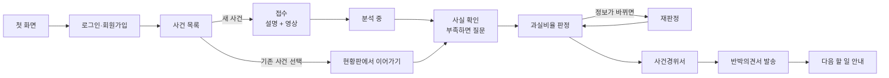
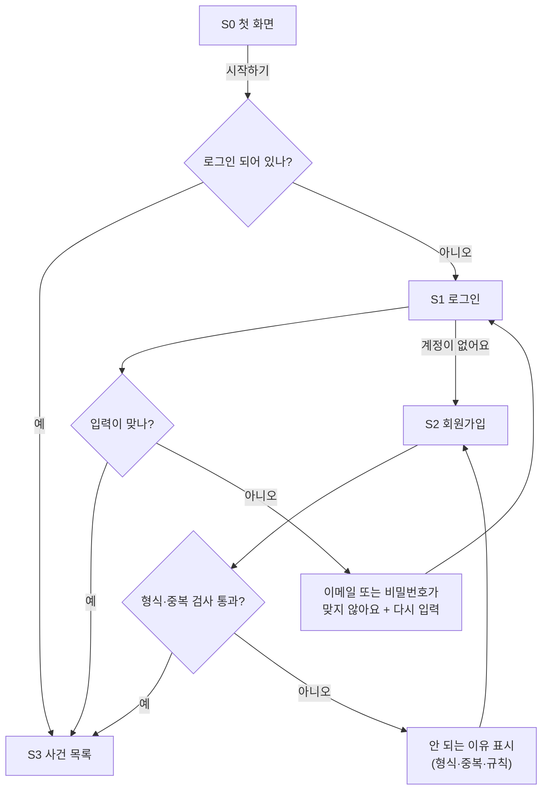
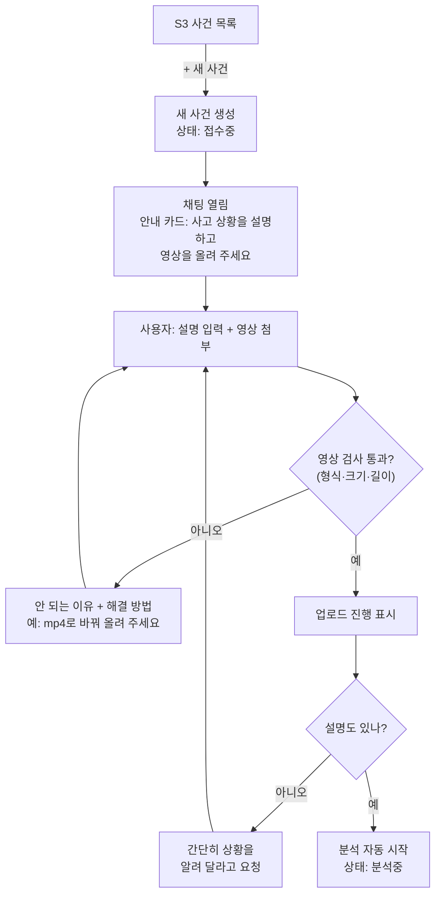
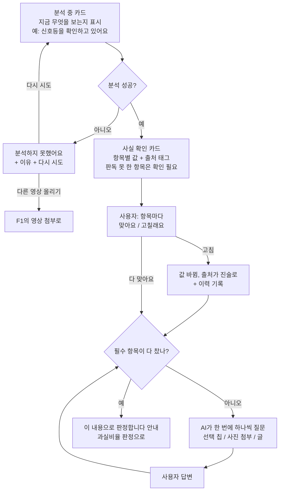
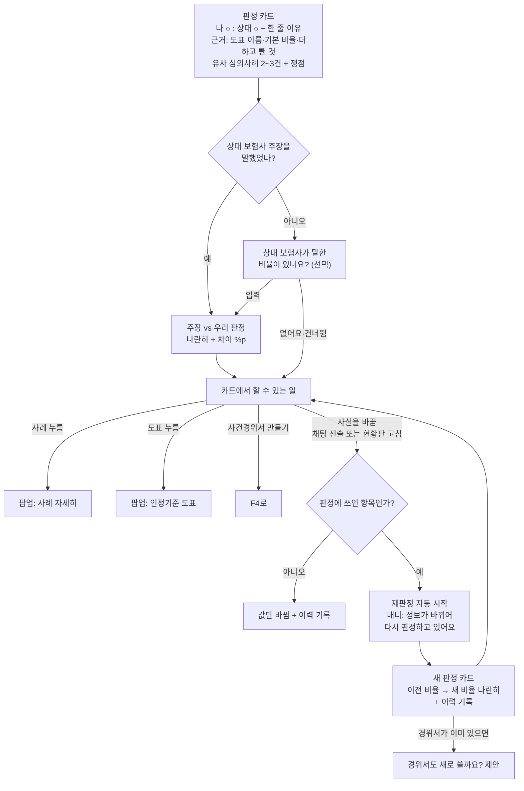
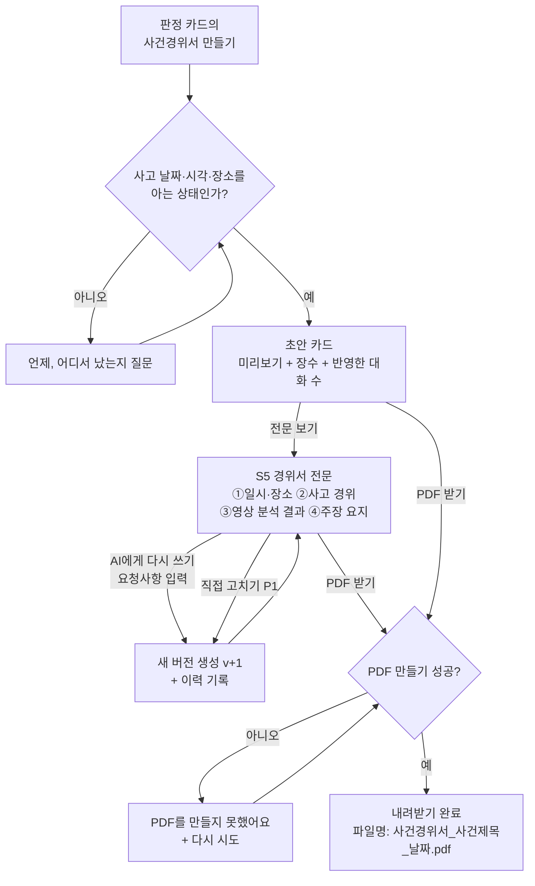
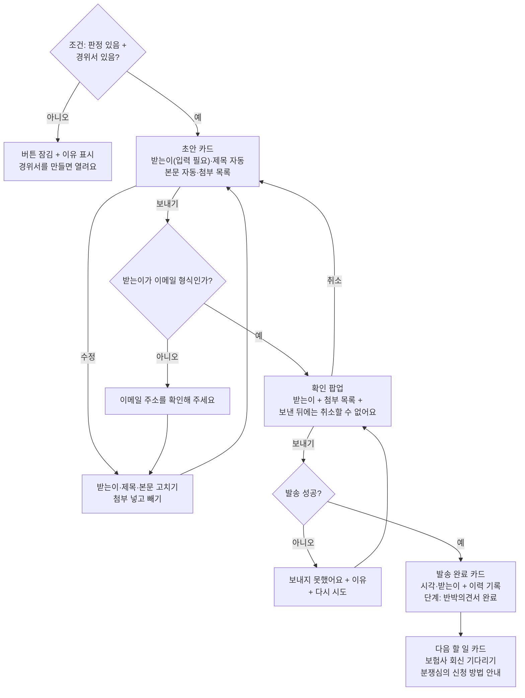
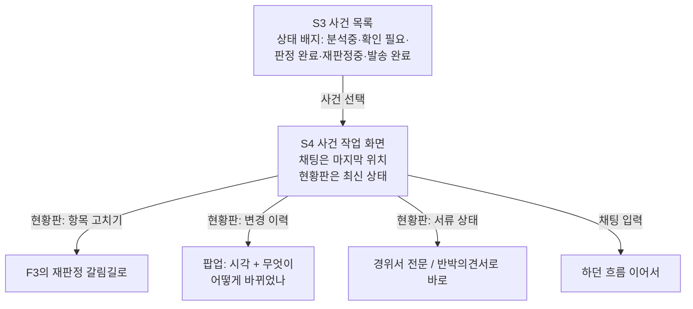

# 유저플로우 — 사용자가 오가는 길 (v2)

> v2 (2026-08-25). 기획자의 유저플로우(8/24 노션 내보내기)를 바탕으로 다시 그렸다.
> 바꾼 이유는 맨 아래 "기획자 원본에서 바꾼 것"에 정리했다.
> 화면 이름(S0~S6)은 02_IA_화면지도.md, 기능 번호(1.1 등)는 04_기능명세서.md와 같다.

## 전체 지도 (한눈에)

아래는 구간별 자세한 길이다. 마름모(◇)는 갈림길, 화살표 글자는 조건이다.

---

## F0. 들어오기와 로그인

규칙:
- 회원가입 성공 = 바로 로그인 상태로 사건 목록에 도착. 다시 로그인시키지 않는다.
- ★ 심사위원 대비: 웹 주소를 열면 로그인에 막히지 않아야 한다. (체험 계정 자동 로그인 또는 로그인 생략 중 팀 결정 — 04 문서 6.3)

## F1. 사건 만들기와 영상 올리기

규칙:
- 영상 검사 기준(제안): mp4 권장(avi·mov 허용), 최대 200MB, 3분 이내. ★ 정확한 수치는 백엔드·AI와 확정.
- 설명과 영상이 모두 모이면 **버튼 없이 분석이 자동 시작**된다. (기획자 원본의 "분석 시작 버튼"을 없앰 — 채팅에서는 올리면 시작이 자연스럽다)
- 영상 없이 설명만 있으면: "영상이 있어야 정확한 판정이 가능해요"라고 안내하고 영상을 기다린다. 영상 없이 진행은 이번 범위 밖 ★.
- 사건 제목은 분석이 끝나면 AI가 자동으로 붙인다 (예: "교차로 직진 충돌 · 08-22").

## F2. 분석과 사실 확인

규칙:
- 필수 항목(판정에 꼭 필요한 정보): ① 사고 유형 ② 내 차선·진행 방향 ③ 상대 진입 방향 ④ 신호(나·상대) ⑤ 속도·감속(급정거 포함) ⑥ 충돌 부위. 여기에 사고에 따라 AI가 쟁점 항목을 더한다 (예: 정지선 통과 시점).
- 모든 항목에는 출처 태그가 붙는다: **[영상]**(AI가 영상에서 봄) / **[진술]**(사용자가 말함) / **[확인 필요]**(아직 모름).
- 질문은 한 번에 하나씩. 가능하면 고르기 칩을 준다. 시연 사례는 2개 — ① 충돌 부위(앞범퍼 / 우측 앞펜더 / 우측 뒷문 / 뒷범퍼 / 잘 모르겠어요, 화면 H20) ② 정지선 통과(지나고 있었어요 / 못 지났어요 / 기억 안 나요, 화면 H20b). [잘 모르겠어요]·[기억 안 나요]를 고르면 그 항목은 [확인 필요]로 남긴 채 판정하고, 판정 카드의 쟁점 줄로 이어진다.
- 현황판의 사실 목록과 진행 단계("사건 분석")가 실시간으로 바뀐다.

## F3. 과실비율 판정과 재판정

규칙:
- 재판정은 **묻지 않고 자동으로** 시작한다. 대신 배너로 알리고, 끝나면 이전 결과와 나란히 보여 준다. (시안의 "신호 정보가 바뀌어 다시 판정하고 있습니다" 배너와 같음)
- 판정 변경은 반드시 변경 이력에 남는다 (이전 비율 → 새 비율, 바뀐 이유).

## F4. 사건경위서

규칙:
- 경위서를 만드는 조건 = 판정 완료 + 사고 날짜·장소 확보. 부족하면 만들기 전에 질문으로 채운다.
- 단계 "사건경위서"는 **초안이 만들어지면 완료**. PDF 받기는 언제든 다시 할 수 있는 행동일 뿐이다.
- 고칠 때마다 버전이 1씩 오른다 (v1, v2, …). 현황판에 현재 버전이 보인다.

## F5. 반박의견서

규칙:
- 제목 자동값: "과실비율 재검토 요청 (접수번호 ○○)". 접수번호는 선택 입력 — 없으면 괄호를 뺀다.
- 첨부 기본값: 사건경위서 PDF + 블랙박스 영상. 확인 팝업에서 다시 보여 주고, 사용자가 뺄 수 있다.
- 발송한 문서는 그대로 보관한다. 다시 보내려면 새 문서로 만든다 (보낸 기록은 지워지지 않는다).
- ★ 시연에서 진짜 메일을 보낼지(받는이를 팀 메일로), 보내는 척만 할지 백엔드와 결정.

## F6. 다시 방문했을 때

---

## 기획자 원본에서 바꾼 것 (팀 공유용)

| 원본 (8/24 플로우) | v2 | 왜 |
|---|---|---|
| "사건 생성 화면", "추가 정보 요청 화면" 등 화면 단위 | 채팅 속 카드 단위 | 화면 시안이 채팅형인데 플로우만 화면형이라 서로 어긋났다 |
| 갈림길(마름모)에 예/아니오 라벨 없음 | 모든 갈림길에 조건 표기 | 사람마다 다르게 해석하는 것을 막기 위해 |
| "분석 중" 상태 없음 | 분석 중 카드 + 실패 처리 추가 | 영상 분석은 시간이 걸린다. 기다림과 실패를 설계해야 함 |
| "분석 시작 버튼 클릭" | 영상+설명이 모이면 자동 시작 | 채팅에서는 버튼이 군더더기 |
| 재판정 진입이 "신호 정보 변경 입력" 한 곳 | 진입 2곳(채팅 진술, 현황판 고침) + 자동 시작 정책 | 시안의 실제 동작(배너·자동 재판정)과 맞춤 |
| 반박의견서가 3곳에서 열림 (판정·재판정·경위서 화면) | 조건 1개로 통일: 판정 있음 + 경위서 있음 | 언제 열리는지 명확해야 개발이 갈리지 않는다 |
| "로그인 여부?" 마름모의 뜻이 불분명 | 로그인 상태 확인 → 로그인/회원가입 분리 | 실패·중복 등 오류 길 추가 |
| PDF 실패 → 같은 버튼 반복 | 실패 안내 + 다시 시도 (메일도 동일 틀) | 오류 문구 원칙(04 문서 0.7)과 통일 |
