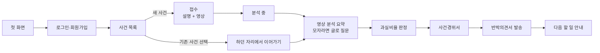
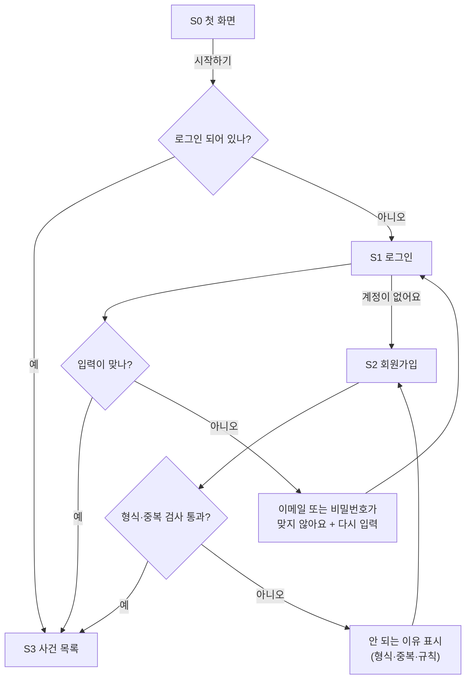
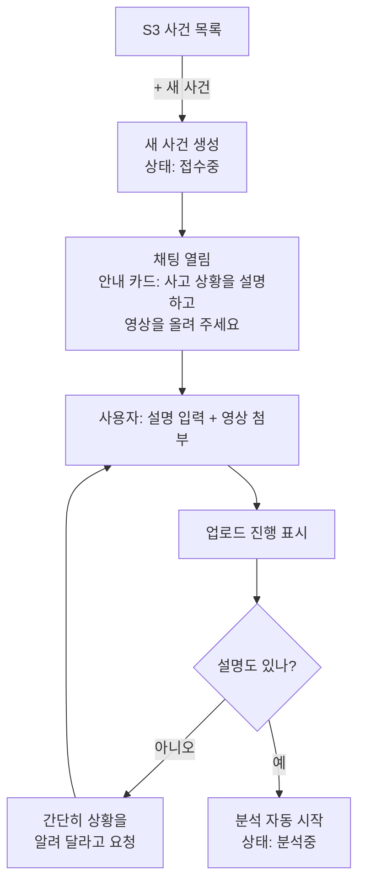
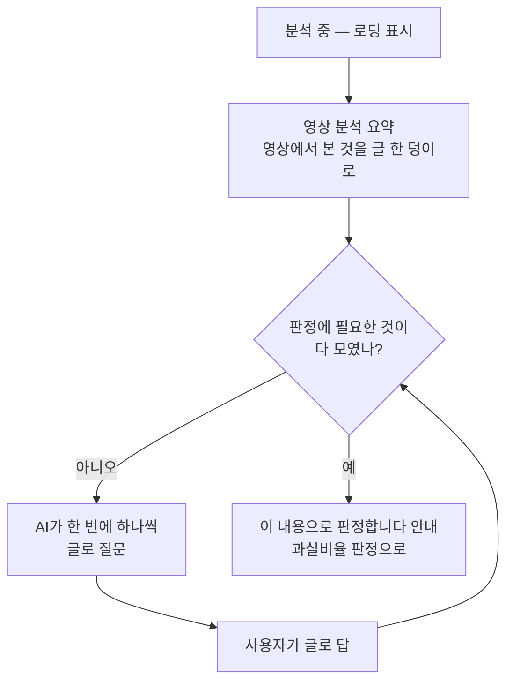
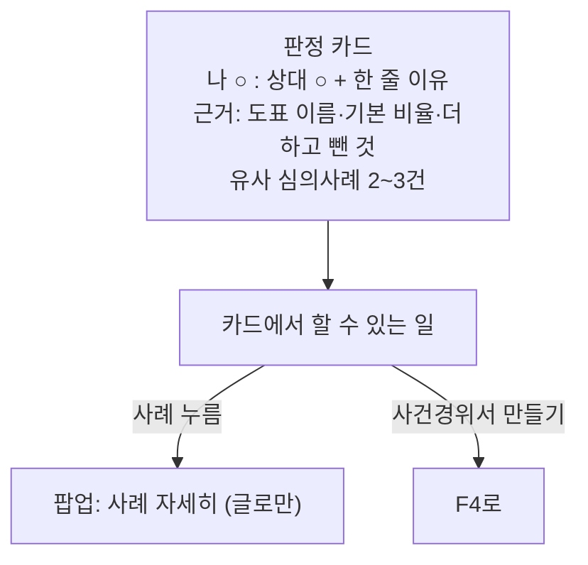
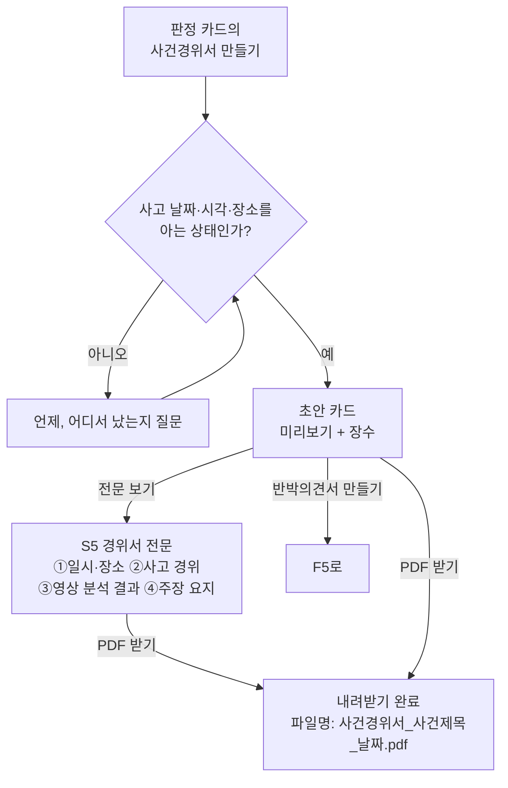
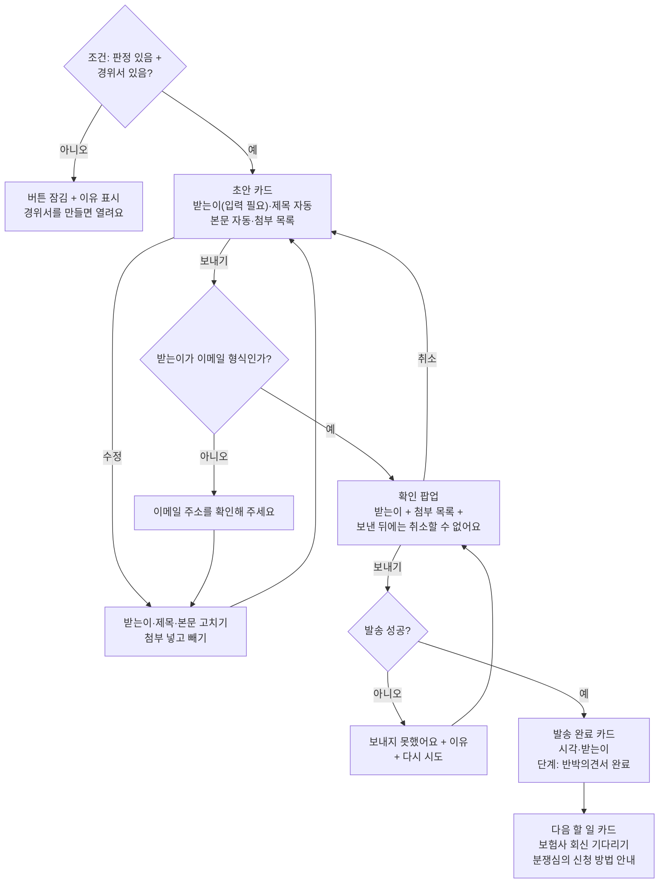
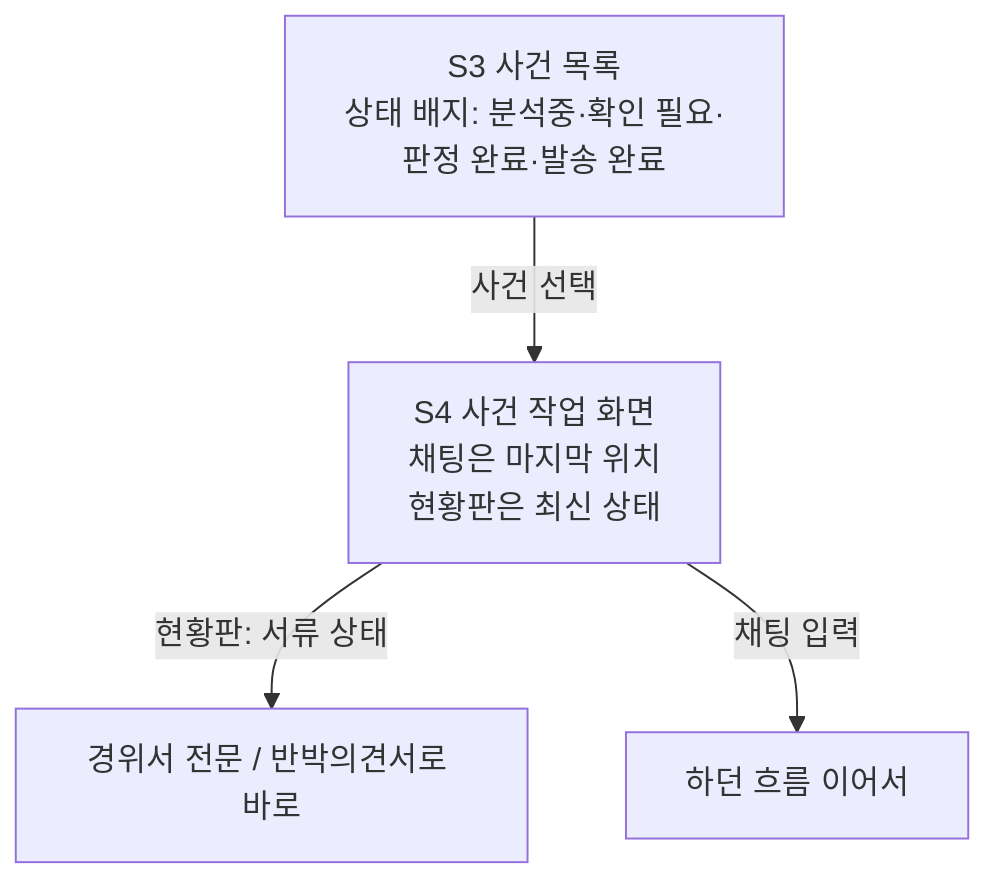

# 유저플로우 — 사용자가 오가는 길 (v2)

> v2 (2026-08-25). 기획자의 유저플로우(8/24 노션 내보내기)를 바탕으로 다시 그렸다.
> 바꾼 이유는 맨 아래 "기획자 원본에서 바꾼 것"에 정리했다.
> 화면 이름(S0~S6)과 기능 번호(1.1 등)는 02_기능명세서.md와 같다.
>
> **2026-09-03 범위 축소 반영.** 재판정·사실 고치기·상대 주장 비교·변경 이력·실패 경로를 뺐다.
> 무엇을 왜 뺐는지는 `04_기획변경.md`. 이 문서와 `04`가 어긋나면 **`04`가 이긴다.**

## 전체 지도 (한눈에)

아래는 구간별 자세한 길이다. 마름모(◇)는 갈림길, 화살표 글자는 조건이다.

---

## F0. 들어오기와 로그인

규칙:
- 회원가입 성공 = 바로 로그인 상태로 사건 목록에 도착. 다시 로그인시키지 않는다.
- **심사위원 대비 (9/5 확정): 사건을 보려면 반드시 로그인한다.** "주소만 열면 로그인 없이"는 요강 근거가
  확인되지 않아 뺐다. 대신 심사 안내에 계정을 함께 적어 준다 (`02` 문서 6.3).

## F1. 사건 만들기와 영상 올리기

규칙:
- 영상 검사 기준(제안): mp4 권장(avi·mov 허용), 최대 200MB, 3분 이내. ★ 정확한 수치는 백엔드·AI와 확정.
- **9/3 축소** — 검사 실패·업로드 취소 갈래를 만들지 않는다. 진행 표시만 두고 끝나면 바로 분석으로 넘어간다.
- 설명과 영상이 모두 모이면 **버튼 없이 분석이 자동 시작**된다. (기획자 원본의 "분석 시작 버튼"을 없앰 — 채팅에서는 올리면 시작이 자연스럽다)
- 영상 없이 설명만 있으면: "영상이 있어야 정확한 판정이 가능해요"라고 안내하고 영상을 기다린다. 영상 없이 진행은 이번 범위 밖 ★.
- 사건 제목은 분석이 끝나면 AI가 자동으로 붙인다 (예: "교차로 직진 충돌 · 08-22").

## F2. 분석과 되묻기

규칙:
- **9/3 축소** — 분석 실패 갈래(h17)와 [분석 멈추기]를 만들지 않는다. 분석 중에는 단계도 보여 주지 않고 로딩 하나만 둔다.
- 분석 결과는 **항목 카드가 아니라 글**이다. 사고마다 볼 것이 달라 항목을 미리 정의할 수 없기 때문이다(h18 대체).
  따라서 사실 확인([맞아요]/[고칠래요])·출처 태그·"확인된 사실 N / 6"이 함께 사라진다.
- 질문도 **글로만** 한다. 선택 칩·사진 첨부 없이 한 번에 하나씩 묻고, 사용자는 채팅으로 답한다.
- 현황판은 예상 과실비율 · 진행 단계 · 서류 세 덩이만 보여 준다.

## F3. 과실비율 판정

규칙:
- **9/3 축소** — 판정 카드에서 다음을 뺀다: 상대 보험사 주장 비교와 차이 %p 안내 · 근거 일치도(%) · 쟁점 줄 · 파란색 강조 박스 전부.
- **재판정은 이번 범위가 아니다.** 사실을 항목으로 고칠 길이 없어 다시 판정할 계기가 없다 (h22·h24·h25 제외).
- 인정기준 도표는 근거 목록의 **글 한 줄**로만 남고 팝업(h38)은 열지 않는다. 도표 번호는 여전히 미확정이라 없으면 칸을 숨긴다.

## F4. 사건경위서

규칙:
- 경위서를 만드는 조건 = 판정 완료 + 사고 날짜·장소 확보. 부족하면 만들기 전에 질문으로 채운다.
- 단계 "사건경위서"는 **초안이 만들어지면 완료**. PDF 받기는 언제든 다시 할 수 있는 행동일 뿐이다.
- **9/3 축소** — 반영 대화 수·쟁점 캡션을 빼고, PDF 실패 갈래(h32)도 만들지 않는다.
- **다시 쓰기(3.2)는 남는다 (9/4 확정).** 진행 상태 화면(h31)만 빼고, 다시 쓰는 동안 단추를 잠가서 알린다.
  대화는 앞으로만 가므로 새 버전 카드가 아래에 하나 더 붙는다.

## F5. 반박의견서

규칙:
- 제목 자동값: "과실비율 재검토 요청 (접수번호 ○○)". **접수번호는 필수 (8/27 — 없으면 보험사가 사건을 못 찾는다).**
  받는이와 접수번호가 둘 다 채워져야 보내기가 열린다. ★팀 확인 필요 — 코드는 `config.ts`의 `REQUIRE_CLAIM_NO` 한 줄이다.
- 첨부 기본값: 사건경위서 PDF + 블랙박스 영상. 확인 팝업에서 다시 보여 주고, 사용자가 뺄 수 있다.
- 발송한 문서는 그대로 보관한다. 다시 보내려면 새 문서로 만든다 (보낸 기록은 지워지지 않는다).
- ★ 시연에서 진짜 메일을 보낼지(받는이를 팀 메일로), 보내는 척만 할지 백엔드와 결정.

## F6. 다시 방문했을 때

---

## 기획자 원본에서 바꾼 것 (팀 공유용)

| 원본 (8/24 플로우) | v2 | 왜 |
|---|---|---|
| "사건 생성 화면", "추가 정보 요청 화면" 등 화면 단위 | 채팅 속 카드 단위 | 화면 시안이 채팅형인데 플로우만 화면형이라 서로 어긋났다 |
| 갈림길(마름모)에 예/아니오 라벨 없음 | 모든 갈림길에 조건 표기 | 사람마다 다르게 해석하는 것을 막기 위해 |
| "분석 중" 상태 없음 | 분석 중 카드 추가 (~~실패 처리~~ — 9/3에 뺐다) | 영상 분석은 시간이 걸린다. 기다림을 설계해야 함 |
| "분석 시작 버튼 클릭" | 영상+설명이 모이면 자동 시작 | 채팅에서는 버튼이 군더더기 |
| ~~재판정 진입이 "신호 정보 변경 입력" 한 곳~~ | **9/3에 재판정 전체가 빠졌다** | 사실을 고칠 길이 없어 다시 판정할 계기가 없다 |
| 반박의견서가 3곳에서 열림 (판정·재판정·경위서 화면) | 조건 1개로 통일: 판정 있음 + 경위서 있음 | 언제 열리는지 명확해야 개발이 갈리지 않는다 |
| "로그인 여부?" 마름모의 뜻이 불분명 | 로그인 상태 확인 → 로그인/회원가입 분리 | 실패·중복 등 오류 길 추가 |
| PDF 실패 → 같은 버튼 반복 | ~~실패 안내 + 다시 시도~~ → **9/3에 PDF 실패를 뺐다.** 이 틀은 발송 실패(h36)에만 남는다 | 오류 문구 원칙(`02` 문서 0.7)과 통일 |

## 9/3에 뺀 것 (범위 축소)

| 뺀 갈래 | 어느 흐름 | 왜 |
|---|---|---|
| 영상 검사 실패·업로드 취소 | F1 | 예외처리를 이번 범위에서 뺀다 |
| 분석 실패·분석 멈추기 | F2 | 같은 이유. 분석 중에는 로딩만 |
| 사실 확인·고치기 (맞아요/고칠래요) | F2 | 사고마다 항목이 달라 카드로 못 박을 수 없다 → 요약 글로 대체 |
| 선택 칩 질문 | F2 | 항목마다 선택지를 미리 정의할 수 없다 → 글로만 묻는다 |
| 상대 주장 비교 · 도표 팝업 · 쟁점 | F3 | 판정 카드를 비율·결론·근거만 남기고 줄인다 |
| 재판정 전부 | F3 | 사실을 고칠 길이 없어 계기가 없다 |
| 경위서 다시 쓰기 **진행 화면** · PDF 실패 | F4 | h31·h32 제외. **다시 쓰기 기능은 남는다** (9/4 확정) |
| 변경 이력 · 상태 배너 | F6 | 남길 변경이 없다 |
